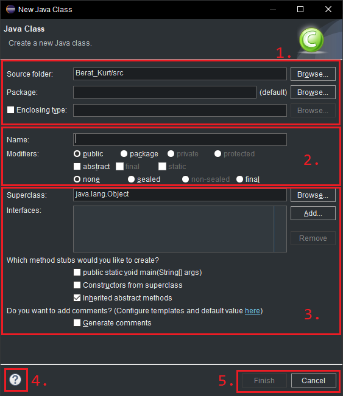

> Bir projeye birçok özellik ekleme şansımız vardır:

## Sınıf ekleme:

* projenizin üzerine imleç ile sağ tık yapıp: `new --> Class` seçeneğini seçin.

---

- dikkat ettiyseniz bu kısımda `Enum`, `Interface`, `Record` ..vs gibi seçenekler bulunuyor.

- şimdilik sadece sınıf oluşturmayı öğreneceğiz. Diğer kavramlar için şimdilik bekleyin. Beklediğinize değecek.

* 'Class' seçeneğine tıkladıktan sonra karşınıza sınıf ayarları yapmak için pencere çıkacaktır.

* Numaralandırdığım ifadeleri teker teker açıklayalım:

---

#### 1. Kayıt dizini:

* `Source folder` kısmında sınıfın kaydolacağı proje dizinini seçer.

* src'nin altında oluşturulur.

* `Package` ve `Enclosing type` kısmına dokunmayın. Şimdilik öğrenmeye gerek yok.

#### 2. Proje ismi ve Erişilebilirlik.

* `Name` kısmında proje ismi belirlenir. Proje ismini:

    - İlk karakter sayıyla veya `_` işareti dışında herhangi bir özel karakter ile başlanmaz.

    - Büyük harfle başlayarak yazılır,

    - Boşluk yerine `_` kullanılır.

    - Şimdilik uyarı verse de paket belirtmeyin.

    - Sınıflar aynı isimde olmamalıdır.

* `Modifiers` kısmına şimdilik bakmayın.

#### 3. İnce ayarlar:

* burayı ileride açıklayacağız.

#### 4. - 5. Yardım bölümü - Oluşturma/iptal etme:

* aklınıza bir soru takılırsa veya ne yapacağınızı bilemiyorsanız bu kısımdan yardım alabilirsiniz.

* Sınıf tanımlama işini başarı ile hallettiyseniz `Finish` deyip sınıf oluşturma işlemini tamamlayınız veya Vazgeçtiyseniz `Cancel` de diyebilirsiniz.

artık sınıf tanımlamayı da başarıyla öğrendiniz.

önceki sayfaya dönmek için [buraya](../ders000.md) tıklayınız.

**Author:** Berat Kurt

