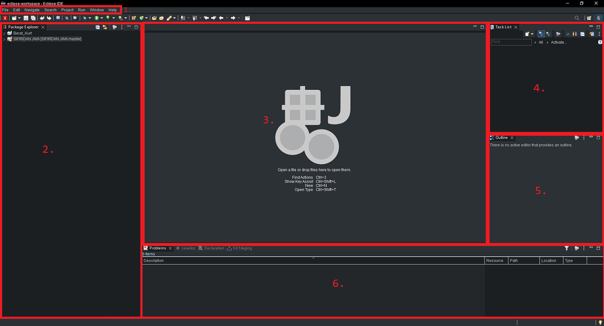
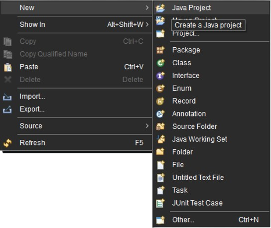

> Eclipse arayüzünü tanıyalım ve ne işe yaradığını açıklayalım.

## Eclipse Arayüzü:

    Eclipse IDE programını ilk açtığınızda böyle bir arayüz ile karşılaşırsınız:

#### 1: Program Ayarları:

* Her programda olduğu gibi, içerisinde `Dosya Ayarları`, `Seçenekler`, `Çalıştır`, `İleri-Geri` vs. tarzında seçenekleri bulunur.

#### 2: Package Explorer:

* Tüm projelerinizi içerisinde tutan ve istenildiğinde erişip direkt düzenlemeler yapılabilen proje deposudur.

#### 3: Kod Yazma Alanı:

* Kaynak kodları bu alanda görünür.

* Sekmeler halinde veya bölünme özelliğine sahiptir. Bu sayede kaynak kodları daha esnek geliştirilebilir.

#### 4: Task List:

* Bir proje geliştirirken yapılacakları ifade eden alandır.

* İlgili kaynak kodda bazı özel karakterlerle bir cümle yazıldığında direkt Task List'de görünür. 

* Bu sayede programın anlaşılırlığı artar.

#### 5: Outline:

* `Taslak` da denmektedir.

* Bir projenin hiyerarşi ağacını gösterir.

* Projeyi görsel olarak anlamayı sağlar ve bu yapı projeye kolaylık ve esneklik katar.

#### 6: Outputs

* Neredeyse her IDE editöründe bulunan bir özelliktir ve çıktı işlemleri ile sorumlu alandır.

* programda oluşan `Hataları`, `Konsol Çıktısını`, `Dökumanları` ve benzerlerini burada görüntülenir.

* olası hata yönetimleri ve anlaşılırlığı üst düzeye taşır.

---

## Proje Nedir Ve Nasıl Oluşturulur ?

* Programların prototip haline `Proje` denir. Programlar, projeler aracılığı ile gelişir.

* Eclipse IDE ortamında proje oluşturulurken bu projeler varsayılan olarak `bin` ve `src` adında iki klasöre ayrılır:

    - bin (binary): kaynak kodların `bytecode` karşılığını saklar.

    - src (source): kaynak kodları saklar.

> Şimdilik `paket` kavramına değinmeyeceğiz. İleriki derslerde detaylıca değinip mini projeler hazırlayabiliriz.

* package explorer'in üstüne gelip sağ tık yapın ve `new --> Java Project` seçeneğine tıklayın.

---

* sizlere proje ile ilgili ayarlar gelecektir:

---

#### 1. Project Name:

* Projemize bu kısımda isim vereceğiz. Bazı özel karakterler dışında isimlendirme konusunda herhangi bir kısıtlama **yoktur**.

#### 2. Location:

* Projemizi hangi dizine kaydedeceğimizi sorar. Varsayılan olarak `eclipse-workspace` dizinine kaydeder.

* dilerseniz varsayılan tikini kaldırıp istediğiniz dizine yönlendirme yapabilirsiniz.

#### 3. JRE:

* Projenizde hangi JRE sürümünün kullanılacağını belirler. Dilerseniz tikleri kaldırıp dilediğiniz JRE sürümüne yönlendirme yapabilirsiniz.

#### 4. Project Layout:

* Kaynak kodlarının ve derlenmiş sınıf dosylarını nasıl organize edebileceğimizi belirler.

* dilerseniz `Configure default` seçeneğini işaretleyerek kendi proje hiyerarşinizi belirleyebilirsiniz.

#### 5. Module:

* Kaynak kodlarınızı daha rahat tarif edebilmeniz için bir java kaynak kodu oluşturur. Bu, modüler projeler için oldukça gereklidir.

#### 6. Konrtol Butonları:

* Proje ayarlarınızı bitirdiyseniz, geri-ileri dönmek istiyorsanız veya projenizi iptal edecekseniz bu butonlara tıklamak yeterlidir.

> Artık Java projesi oluşturmayı öğrendiniz.

**Author:** Berat Kurt

bir önceki dosyaya dönmek için [buraya](../ders000.md) tıklayınız.

**Author:** Berat Kurt