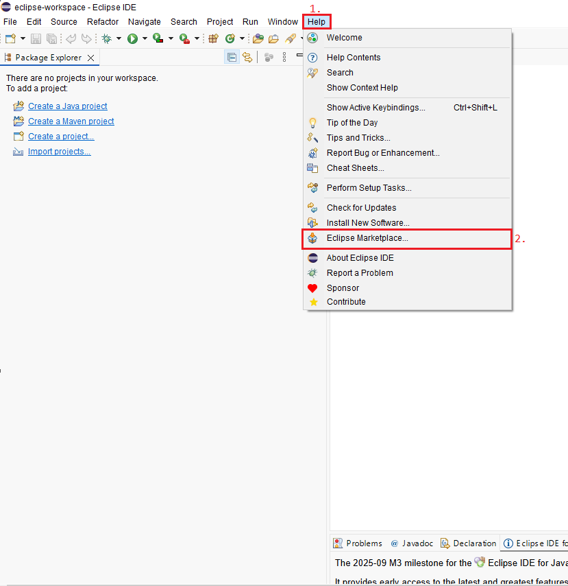

## Eclipse Market Nedir Ve Ne İşe Yarar ?

* Geliştirme yaparken daha verimli ve kolay işler yapabilmek için eklentilerin bulunduğu alana `Eclipse Marketplace` denir.

* Bizlere son derece kolaylık sağlayan ekletiler mevcuttur.

---

## Eclipse Marketplace'e giriş

* Eclipse'i açın ve üstteki çubuktan `Help` kısmına ve ordan `Eclipse Mareketplace`'e girin.

## İçerisinde neler var ?

* Benim gibi `Koyu Tema` kullanıcıysanız **Darkest Dark Theme** eklentisini indirebilirsiniz (şiddetle önerilir 👍).

* Yazdığınız kodların kalitesini denetleyip ve daha verimli hale getirmek için `Sonar Lint ` eklentisini kurabilirsiniz.

* Yazdığınız kodların, kod yazım standartına göre derli hale getirmek için `Check Style` eklentisini kurabilirsiniz.

> ve daha sayamadığım birçok özellik markette bulunuyor.

Önceki dosyaya dönmek için [buraya](../README.md) tıklayınız.

**Author:** Berat Kurt

