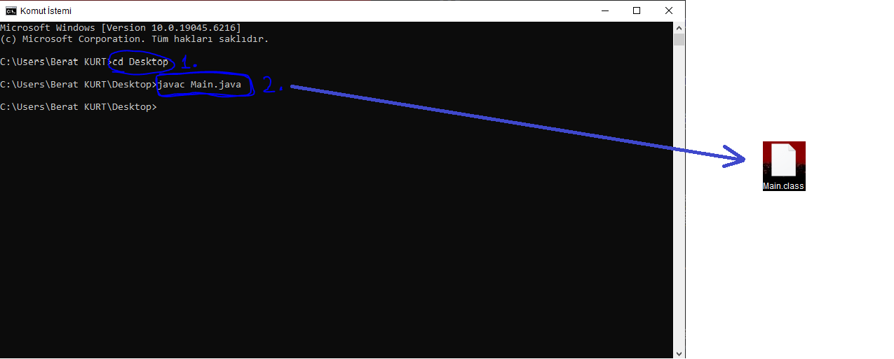

> Öncelikle Java'nın bu üç temel kavramı üzerine değinelim.

### JDK (Java Development Kit) Nedir:

* Java geliştirme yapmak isteyenler için bir `SDK(Software Development Kit - Yazılım Geliştirme Kiti)` görevi görür.

* **Yazmak, Derlemek ve Çalıştırmak** için gerekli tüm araçları barındırır. (javac, javadoc, jcb)

* Bilgisayarınıza yanlızca *JDK indirirseniz* geriye kalan tüm araçlara sahip olursunuz.

---

### JRE (Java Runtime Environment) Nedir:

* Java programını yazarken tüm temel ve ilkel fonksiyonlar, işlevler ve sınıflar bu kısımda gömülü bulunur.

* Fakat yazılan kodları derleyemez. ama bytecode'ları çalıştırabilir. (Sadece kütüphane desteği sağlar ve JVM bulunur)

* içerisinde `Hata Yönetimi(Exception Handling)`, `Sınıfları Efektif Kullanma (Object)`, `Giriş/Çıkış (I/O) işlemleri`, `Veri yapıları (Data Structures)` ve daha nicesi bulunmaktadr.

* İçerisinde `JVM` de mevcuttur. Yazılım geliştirme imkânı sunmaz.

---

### JVM (Java Virtual Machine) Nedir:

* `Java Sanal Makinesi` de denmektedir. Java programının çalıştığı platform ile java programı arasında soyut bir katmandadır. 

* Temel görevi, Java bytecode'unu alıp işletim sisteminin anlayabileceği binary code'a çevirip iletişimi sağlamaktır.

* JVM, platforma bağımlı entegre edilir. Sebebi ise iletişim kuracağı platforma özgü binary kodlar üretmelidir.

* Aynı bytecode, farklı JVM makinelerinden geçerek aynı çıktıyı çıkarabilirler.

---

### Kıyaslayalım..

| Özellik / Bileşen  | **JVM** | **JRE** | **JDK** |
|---------------------|---------|---------|---------|
| Açılım              | Java Virtual Machine | Java Runtime Environment | Java Development Kit |
| Amacı               | `Bytecode’u çalıştırmak` | `Java programlarını çalıştırmak` | Java programlarını `geliştirmek` ve `çalıştırmak` |
| İçerik              | Sadece JVM | JVM + kütüphaneler | JRE + geliştirme araçları |
| Kullanıcı Kitlesi   | Çalıştırma motoru | Programı çalıştırmak isteyen kullanıcı | Java geliştiricileri |
| Derleyici (javac)   | Yok | Yok | Var |
| Geliştirme Araçları | Yok | Yok | Var |
| Uygulama Çalıştırma | Var | Var | Var |

---

## JDK Nasıl İndirilir ?

* öncelikle [buraya ](https://www.oracle.com/tr/java/technologies/downloads/) tıklayıp `Oracle`'nin internet sitesine giriniz.

* Size uygun olan platformda ve uygun tabanda indirme işlemini gerçekleştiriniz. (windows, Linux, MacOs; x32, x64 veya x86 işlemci tabanları mevcut.)

* uygun ve güncel JDK'yı indirdikten sonra kurulum dosyasını açınız.

* kurulumu bitirmeden önce `next steps` seçeneğine tıklarsanız sizin indirdiğiniz JDK sürümüne göre çeşitli araçların tanıtımı görünecektir.


---

## JDK Çalışıyor mu ?

* eğer kurulumu eksiksiz yaptıysanız masaüstünden arama çubuğuna `cmd` yazıp *komut istemcisi*ni çalştırın. 

* ardından hem Java ortamının ve Java derleyecisinin `direkt` çalışıp çalışmadığını anlamak için:

```
java -version
javac -version
```

**yazıp deneyiniz. Eğer kurulum doğruysa sizlere sürüm ile birlikte kurulu olduğunu gösterecektir**.


--- 

* Eğer sürümleri göstermezse, **kurulum doğru**, fakat sistem yolunu direkt olarak belirtemiyoruz.


---

* sistem yolu direkt belirtilemezse `Ortam Değişkenleri (PATH)` ayarlarına ekleme yapmamız gerekecek.

* Böyle bir problem ile karşılaşırsanız arama çubuğuna `Sistem Ortam Değişkenlerini Düzenleyin` diye aratıp tıklayınız.


* ardından `PATH` seçeneğini seçip bir yol oluşturunuz. Yolu JDK kurulu olan dizinin `bin` klasörüne yönlendiriniz.

    - `bin` klasörüne yönlendirmediğiniz takdirde kurulumu bilgisayar fark edemeyecektir.

* ardından gönül rahtlığı ile JDK'yı kurdunuz.

## Örnek Kod 

```java
public class Main {
    public static void main(String[] args) {
        System.out.println("Merhaba ben java !");
    }
}
```

* Yukarıdaki örnek kodu alın ve bir not defterine yapıştırın.

* Ardınan dosyanın ismini `Main.java` olarak kaydedin (kaydetmezsek program derleme yapmaz).


---

* CMD'yi çalıştırın ve dosyanın bulunduğu dizine yönlendirin. (ben masaüstünde kaydettiğim için masaüstüne yönlendirme yapacağım)

> Yönlendirme komutu, `cd` yazın, boşluk bırakın ve dizini yazın.

* Şimdi derleme işlemi uygulanacaktır. `javac Main.java` deyip `.class uzantılı bytecode'a derleme işlemi uygulayacağız.` 



---

* JVM tarafından bytecode'u çalıştırmak için `java` isminde bir çalıştırma aracına ihtiyacımız var.

* çalıştırmak için `java Main` dedikten sonra program çalışacaktır ve ekrana **Merhaba ben java !** diye yazdıracaktır.


> Bu şekilde artık Java programlarının çalışma mantığını da `Temel Düzeyde` öğrendik. İlerleyen zamanda `Sınıf`, `Nesne` ve `paket` mantığını da öğrendikten sonra daha karmaşık projeleri yürütmeyi de öğreneceğiz.


önceki sayfaya dönmek için [buraya](../README.md) tıklayınız.

**Author:** Berat Kurt  
