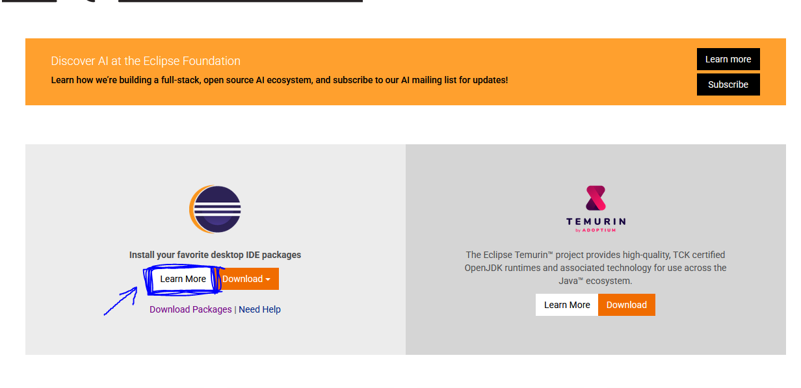

## 1.) Eclipse IDE (bunu yüklemeniz tavsiye edilir.)

* Java programlama dili ile geliştirme yaparken sizlere oldukça gerekli olduğunu düşündüğüm bir geliştirme ortamıdır.

* Tümleşik ve açık kaynak kodlu, `Özgür` bir yazılımdır.

* Ana odağı Java teklonojileri olsa da esnekliği sayesinde `Pyton` ve `C` gibi diller için de Geliştirme imkanı sunar.

* Profesyonel kod ve proje yazılabilir.

## 2.) NetBeans

* `Oracle` tarafından geliştirilen bir IDE'dir.

* Özellikle *Kullanıcı Arayüzü* tasarım kolaylığı ile dikkat çeker

* Üniversite düzeyindeki kişiler için uygundur.

* Karmaşık projelerde verimli olmayabilir.

## 3.) Intellij IDEA (ücretli)

* Java ve birçok dilde geliştirme yapmak için kullanılan `tümleşik` geliştirme ortamıdır.

* Gelişmiş özelliklerin açılması için ücret talep etmektedir.

---

> Bizler bu serimizde `Eclipse IDE` geliştirme ortamından gideceğimiz için Eclipse Kurulumundan bahsedeceğim.

## Nasıl İndirilir ?

---

[Buradan](https://www.eclipse.org/) Eclipse'nin resmi sitesine giriniz.

* Sağ üst kısımda bulunan `Download` seçeneğine tıklayın.

* Karşınıza çıkacak olan seçeneklerlerden `Install your favorite desktop IDE packages` seçeneğinden `Learn More`' a tıklayınız.

* 

* Karşınıza çıkan download seçeneğini işaretleyiniz. Ardından Size hangi IDE'yi kurmak istediğinizi soracaktır.

* Sizler `Eclipse IDE for Java Developers` kısmından uygun olan işletim sistemi ve sürümünüzü seçip indirin.

---

## Nasıl kurulur ?

* Herhangi bir kulurum zahmeti yok aslında, İndirilen .zip dosyanızı bir klasöre çıkarın ve `Eclipse.exe` yi çalıştırın.

* sizlere varsayılan bir klasör ataması yapacaktır, Oluşturacağınız tüm projeler bu klasörde tutuluyor.

* Geliştirme kitiniz de tamamdır.

Önceki sayfaya dönmek için [buraya](../README.md) tıklayınız.

**Author:** Berat Kurt