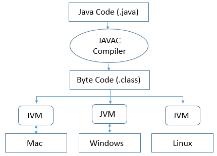

### Java Nedir:

Java programlama dili `Sun Microsystems` tarafından 1995 yılından geliştirilen *Nesne Tabanlı (OOP)*, yüksek seviyeli, ve **platformdan bağımsız** dildir.

Yani bir kere yazıp herhangi bir platform (Windows, Linux, Mac)
fark etmeden *her yerde* çalıştırabilirsiniz.

Diğer dillerde programlama yaparken o işletim sistemine bağlı olarak bir derleme işlemi uygulamalıyız ve bu maliyetleri ve taşınabilirliği oldukça `olumsuz` etkilemektedir.

---

### Temel Özellikleri:

**1. Platformdan Bağımsızlık**

* Java kaynak kodları öncelikle byte koduna (bytecode) derlenir. Oluşan byte kodları, Çalıştığımız sisteme özgü olarak kurulan Java Sanal Makinesi (JVM) tarafından yorumlanır ve çalıştırılır. 

* Kodlarınızı bir sefer yazıp her platformda çalıştırabiliriz.

* Demek ki program çalıştırma işlemi için işletim sisteminin anlayabileceği derlemeyi <mark>dolaylı yoldan</mark> Java Sanal Makinesi yapar ve program çalışır.
 
* Diğer programlama dilleri için kaynak kodlarını derlemek gerektiğinde Çalıştığımız işletim sistemine özgü olan gerekli derleme araçlarını kurup işletim sisteminin anlayabileceği ve donanım ile haberleşebileceği şekilde makine kodlarına çevirip çalıştırabiliriz.

**2. Nesne Yönelimli (OOP)**

* Java'da `Sınıf`, `Nesne`, `Kalıtım`, `Çok Biçimlilik`, `Kapsülleme` gibi OOP kavramları merkeze alınır. 

* Bu sayede kodların <u>karmaşıklığı azalır</u>, <u>bakımı kolaylaşır</u>, <u>düzenli hale gelir</u> ve <u>yeniden kullanılabilir kod parçaları</u> meydana gelir.

**3. Güvenlik**

* Programlar Java Sanal Makinesi üzerinden çalıştığı için doğrudan `donanıma erişim kısıtlanmıştır`. 

* Bu, özellikle ağ tabanlı uygulamalar geliştirirken oldukça güvenli bir dil olur, yazılan kötü amaçlı programlar bilgisayarı kolayca <mark>çökertemez</mark>.

**4. Bellek Yönetimi**

* Benim de özelliklerini beğendiğim ve en sevdiğim önemli bir konuya değindik

* Java Sanal makinesine, kullanılmış ve temizlenmesi gereken bellek hücreleri  `Çöp toplayıcı (Garbage Collector)` sistemi tarafından temizlenir. 

* Manuel bellek temizleye kıyasla olukça kullanışlıdır ve programlama sürecini kolaylaştırır.

* `Bellek sızıntısı` veya `Bellek tükenmesi` gibi sorunların önüne geçer.

**5. Zengin Kütüphaneler**

* Java, içerisinde `Koleksiyonlar (Collections)`, `Giriş/Çıkış (I/O)`, `Çoklu İş Parçacığı (Multithreading)`, `Ağ Programlama` ve `Grafik Arayüzü (GUI)` geliştirme gibi birçok hazır kütüphaneler sunar.

* Çoğu Kütüphanelerde olduğu gibi de bu kütüphane de olduça zaman kazandırır ve kafa karıştırmadan programlar basitleştirir.

---

## Kullanım Alanları:

* Masaüstü Uygulamaları için: `Swing`, `JavaFX`

* Web Uygulamaları için: `Spring`, `Jakarta EE`

* Mobil Uygulamalar (En sık kullanılan): `Android Geliştirme`

* Oyun Geliştirme: `Minecraft`

* Kurumsal Yazılımlar ve Sunucu Tabanları

* Veri Bilimi Ve `Büyük Veriler`

Alanlarında oldukça geniş bir yelpazede hizmet veriyor.

---

## Neden Java ??

* Yaygın kullanılan ve `Güvenilir` bir dildir. Dünya üzerinde <u>3 milyara aşkın sistem, Java dili ile hayat buluyor</u>.

* Platformdan bağımsız olduğu için özgür yazılımı ve esnekliği destekler.

* Uzun yıllar boyunca kullanılmış ve aktif geliştiriciler ile hayat bulmuştur.

*JAVA PROGRAMLAMA DİLİNİ GENEL OLARAK BÖYLE AÇIKLAYABİLİRİZ*

---

## Nasıl Çalışır ?

* Kaynak kodları `.java` uzantılı bir dosyada bulunur ve **Java Compiler (Javac)** programı tarafından bytecode'a çevrilir.

* Çevrilen bytecode, `.class` uzantılı bir dosyada tutulur.

* ardından `JVM` tarafından bytecode işlenir işletim sistemi ile haberleşmeye başlar, (program çalışmış olur.)

Görsel Olarak da:

bu şekilde olur.

* Görselde de görüldüğü üzere hangi platform olursa olsun aynı bytecode, Java Sanal Makinesi tarafından çalışabiliyor.

önceki sayfaya dönmek için [buraya](../README.md) tıklayın.

**Author:** Berat Kurt
